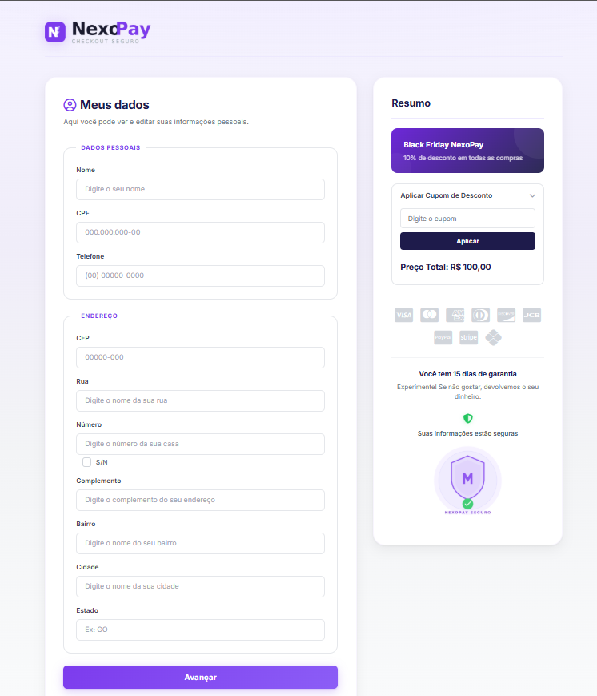

<div align="center">

# NexoPay

**Pagina de checkout moderna e responsiva com validacao de formulario, integracao com API ViaCEP e sistema de cupons de desconto.**


[Funcionalidades](##-funcionalidades) &bull; [Demonstracao](#-demonstracao) &bull; [Tecnologias](#-tecnologias) &bull; [Como usar](#-como-usar) &bull; [Aprendizados](#-aprendizados)

</div>

---

## Sobre o projeto

O **NexoPay** e uma pagina de checkout que simula o fluxo de pagamento de um produto digital. O projeto foi desenvolvido com foco em boas praticas de HTML semantico, estilizacao moderna com CSS puro e logica de validacao com JavaScript vanilla.

## Funcionalidades

- **Formulario completo** com campos de dados pessoais e endereco
- **Mascaras de input** para CPF (`000.000.000-00`), telefone (`(00) 00000-0000`) e CEP (`00000-000`)
- **Integracao com a API ViaCEP** - preenche rua, bairro, cidade e estado automaticamente ao digitar o CEP
- **Validacao de campos** com mensagens de erro individuais em tempo real
- **Sistema de cupons de desconto** com feedback visual de sucesso ou erro
- **Checkbox S/N** que desabilita o campo de numero do endereco quando marcado
- **Persistencia com localStorage** - salva os dados do formulario e cupom aplicado
- **Design responsivo** com 5 breakpoints (920px, 768px, 480px, 360px)
- **Acessibilidade** - respeita `prefers-reduced-motion` e usa `focus-visible` nos elementos interativos

## Demonstracao

### Desktop

<div align="center">
  
</div>

### Mobile

<div align="center">
  
</div>

## Tecnologias

| Tecnologia | Uso no projeto |
|---|---|
| **HTML5** | Estrutura semantica com `fieldset`, `legend`, `label` e `form` |
| **CSS3** | Layout com CSS Grid, Custom Properties, gradientes, transicoes e media queries |
| **JavaScript** | Manipulacao do DOM, Fetch API, RegEx, localStorage e validacoes |
| **ViaCEP API** | Busca automatica de endereco a partir do CEP |
| **Font Awesome** | Icones de bandeiras de cartao e interface |
| **Google Fonts** | Tipografia com a fonte Inter |

## Estrutura do projeto

```
NexoPay/
├── assets/
│   ├── logo_1.png        # Icone do logo
│   ├── logo_2.png        # Texto do logo
│   └── safe.png          # Selo de seguranca
├── index.html            # Pagina principal
├── style.css             # Estilos e responsividade
├── formulario.js         # Mascaras, validacoes e API ViaCEP
├── desconto.js           # Sistema de cupons de desconto
└── README.md
```

## Como usar

1. Clone o repositorio:
   ```bash
   git clone https://github.com/JoaoMarcos347/NexoPay.git
   ```

2. Abra o `index.html` no navegador ou use a extensao **Live Server** no VS Code.

3. Para testar os cupons de desconto, use:

   | Cupom | Desconto |
   |---|---|
   | `NEXOPAY10` | 10% |
   | `NEXOPAY20` | 20% |
   | `NEXOPAY50` | 50% |

## Aprendizados

Este projeto me ajudou a praticar:

- **Consumo de API REST** com `fetch` e tratamento de resposta JSON
- **Regex** para criacao de mascaras de input em tempo real
- **Validacao de formularios** com feedback visual sem depender de bibliotecas
- **CSS Grid** para layout de duas colunas com reorganizacao no mobile
- **CSS Custom Properties** para manter consistencia no design system
- **localStorage** para persistencia de dados no navegador
- **Responsividade** com abordagem desktop-first e multiplos breakpoints

## Autor

Feito por **[João Marcos](https://github.com/JoaoMarcos347)**

---

<div align="center">

Se este projeto te ajudou de alguma forma, deixe uma estrela!

</div>
